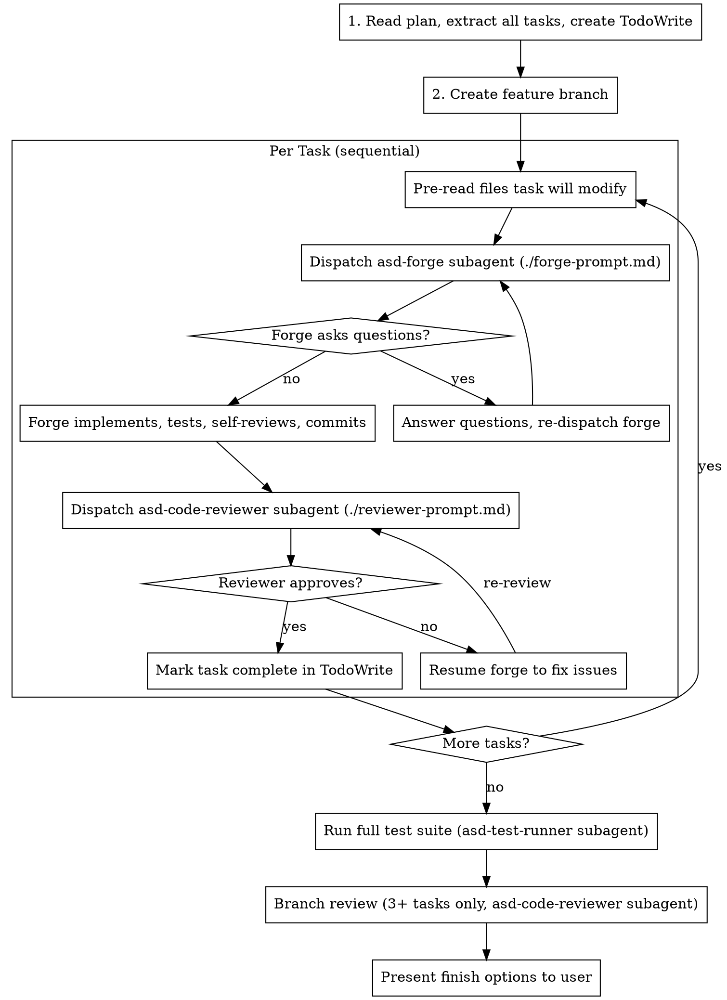

# Execution checkpoints

Execute validated plans using subagent-driven development. Each task runs in a fresh `asd-forge` subagent via the Agent tool, reviewed, then the next task begins.

**Core principle:** Fresh subagent per task + review after each = high quality, no context pollution

<HARD-GATE>
You MUST use the Agent tool to spawn a subagent for EVERY task implementation and EVERY review.
You MUST NOT write implementation code, edit files, or run tests yourself in the main context.
Your only job as orchestrator is to: read the plan, pre-read files, launch subagents via Agent tool, and track progress.
If you catch yourself writing code or editing files directly, STOP and use the Agent tool instead.
</HARD-GATE>

## Process



## Prompt templates

Use these templates when constructing Agent tool calls:

- `./forge-prompt.md` - Template for dispatching asd-forge subagent
- `./reviewer-prompt.md` - Template for dispatching asd-code-reviewer subagent

## Phase 1: Load and prepare

1. Read the plan file once. Extract every task's full text (including file paths, code, commands, acceptance criteria). Store in memory - do not re-read the plan during execution.
2. Note inter-task context: what each task produces that later tasks need.
3. **Immediately create a TodoWrite checklist with ALL tasks before doing anything else.** This is mandatory - do not proceed to branch setup or execution without it.

Call TodoWrite with every task from the plan. Include dependency info so the user sees which tasks can run in parallel:

```
TodoWrite:
  tasks:
    - id: "task-1"
      description: "Task 1: [task name]"
      status: "pending"
    - id: "task-2"
      description: "Task 2: [task name]"
      status: "pending"
    - id: "task-3"
      description: "Task 3: [task name] (depends on #1, #2)"
      status: "pending"
    ... (one entry per plan task)
    - id: "verify"
      description: "Verify: no regressions across full test suite"
      status: "pending"
```

The user must see the full task list with checkboxes before execution begins. Update each task to `in_progress` when starting it and `completed` when its review passes.

## Phase 2: Branch setup

First, check for uncommitted changes:

```bash
git status --porcelain
```

**If there are uncommitted changes:** Create a git worktree to isolate execution from the current work.

```bash
git worktree add ../feat-<plan-name> -b feat/<plan-name>
cd ../feat-<plan-name>
```

Tell the user: "You have uncommitted changes, so I'm working in a separate worktree at `../feat-<plan-name>`. Your current work is untouched."

**If working tree is clean:** Create a branch normally.

```bash
git checkout -b feat/<plan-name>
```

Never start implementation on main/master without explicit user consent.

## Phase 3: Build dependency graph and execution waves

Each task in the plan has a `Depends on:` field. Use it to build waves of tasks that can run in parallel.

### 3a. Analyze dependencies

Parse each task's `Depends on:` field:
- `-` or empty = no dependencies (can run immediately)
- `1, 3` = must wait for tasks 1 and 3 to complete

If the plan has no `Depends on:` fields, infer dependencies from file paths: if task B modifies or reads a file that task A creates, B depends on A. When in doubt, make it sequential.

### 3b. Group into waves

Group tasks into waves where all tasks in a wave have their dependencies satisfied:

```
Wave 1: [tasks with no dependencies]
Wave 2: [tasks that depend only on Wave 1 tasks]
Wave 3: [tasks that depend on Wave 1 or 2 tasks]
...
```

Display the execution plan to the user:
```
Wave 1 (parallel): Task 1, Task 2, Task 4
Wave 2 (parallel): Task 3 (depends on #1, #2)
Wave 3 (sequential): Task 5 (depends on #3)
```

If all tasks are sequential (each depends on the previous), there's only one task per wave - that's fine.

### 3c. Execute each wave

**For waves with a single task:** Run it directly in the current branch. No worktree needed.

**For waves with multiple tasks:** Each task runs in its own worktree so they don't conflict.

For each task in the wave:
1. Create a worktree: `git worktree add ../task-N-<name> -b task-N/<name>`
2. Pre-read files the task will modify
3. Launch Agent tool with `subagent_type: "asd:asd-forge"` and `isolation: "worktree"`, using `./forge-prompt.md` template

**Launch all tasks in the wave in a single message with multiple Agent tool calls** so they run in parallel.

**If forge returns QUESTIONS:** Answer and re-dispatch. Max 2 question rounds, then escalate to the user.

**If forge returns BLOCKED:** Mark the task as blocked in TodoWrite, continue with other tasks in the wave.

### 3d. Review each task in the wave

After each forge returns DONE, launch review via `./reviewer-prompt.md` template with `subagent_type: "asd:asd-code-reviewer"`. Reviews for completed tasks in the same wave can also run in parallel.

**If issues found:** Resume the forge agent to fix. Re-review. Max 2 iterations.

### 3e. Merge wave results

After all tasks in a wave are reviewed and approved:

**For single-task waves:** Already on the branch, nothing to merge.

**For multi-task waves:** Merge each task branch into the feature branch:

```bash
git merge task-N/<name> --no-edit
```

If merge conflicts occur, stop and ask the user - parallel tasks touched overlapping files unexpectedly.

After merging, clean up worktrees:

```bash
git worktree remove ../task-N-<name>
git branch -d task-N/<name>
```

Mark all wave tasks as `completed` in TodoWrite, then proceed to the next wave.

## Phase 4: Final verification

After all tasks complete, use the Agent tool to launch an `asd-test-runner` subagent to run the full test suite. If no test suite exists, verify manually.

## Phase 5: Branch review (3+ tasks only)

Skip for plans with fewer than 3 tasks - per-task reviews are sufficient.

Call the Agent tool with `subagent_type: "asd:asd-code-reviewer"`:

```
Review scope: branch-level
Diff: git diff <base-branch>..HEAD
Focus on cross-task integration issues only. Per-task reviews already passed.
Report PASS or list issues.
```

**If issues found:** Fix, re-test, re-review. Max 2 iterations.

## Phase 6: Finish

Present options to the user:

1. **Merge locally** - merge into base branch, run tests, delete feature branch
2. **Create PR** - push and open a pull request with summary
3. **Keep as-is** - leave the branch for later
4. **Discard** - confirm, then delete the branch

After the user chooses (not on discard): if a campaign link exists in the plan (`<!-- campaign: path#item -->`), update the campaign file - mark item done, update progress count, update date. Commit the update.

## Context hygiene

- **Your role:** You are the orchestrator. You read the plan, pre-read files, call the Agent tool, and track progress. You never write implementation code.
- **Subagent prompts:** Use the prompt templates. Pass task text, pre-read files, and one-line prior task summaries.
- **Processing results:** Extract only DONE/BLOCKED/PASS/issues. Discard narrative and reasoning.
- **Between tasks:** Do not accumulate context. Each task starts fresh with its own spec and pre-read files.

## Red flags - never do these

- Write code, edit files, or run tests yourself (use Agent tool)
- Start implementation on main/master without user consent
- Skip reviews or proceed with unfixed issues
- Run tasks in parallel when they have dependencies on each other
- Run parallel tasks without separate worktrees (they will conflict)
- Force-merge when worktree merges conflict (stop and ask the user)
- Make subagent read plan file (provide full text instead)
- Skip scene-setting context (subagent needs to understand where task fits)
- Ignore subagent questions (answer before letting them proceed)
- Accept "close enough" on spec compliance (reviewer found issues = not done)
- Skip review loops (reviewer found issues = forge fixes = review again)
- Move to next wave while current wave has unresolved issues
- Let forge self-review replace actual review (both are needed)

## When to stop and ask

- Hit a blocker (missing dependency, repeated test failure, unclear instruction)
- Plan has critical gaps
- Fix loop exceeds 2 iterations
- Verification fails after fixes
